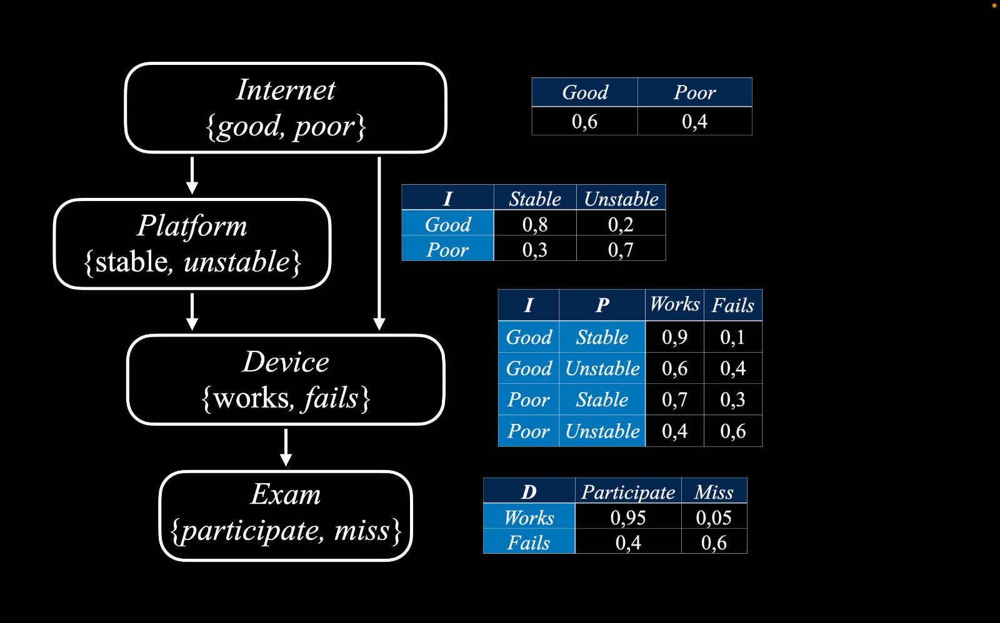

# Determine Probability using Pomegranate 0.14.0

## Prerequisites
- **Python 3.9**: Download and install from [here](https://www.python.org/downloads/release/python-3913/). 
- Make sure to add Python to your system PATH during installation.

## Setup Virtual Environment
1. Create a virtual environment:
   ```bash
   py -3.9 -m venv venv
   ```

2. Activate the virtual environment:
  - On Windows:
    ```bash
    venv\Scripts\activate
    ```

3. Install required packages:
   ```bash
   pip install -r requirements.txt
   ```

## Running the Scripts
- To run the inference script:
  ```bash
  python inference.py
  ```

- To run the likelihood script:
  ```bash
  python likehood.py
  ```

